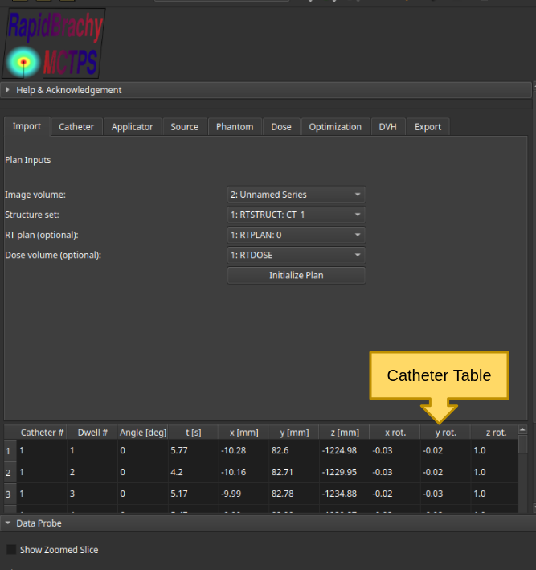
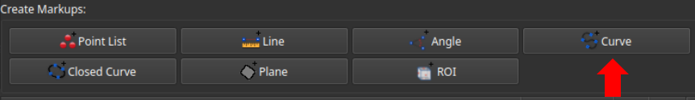
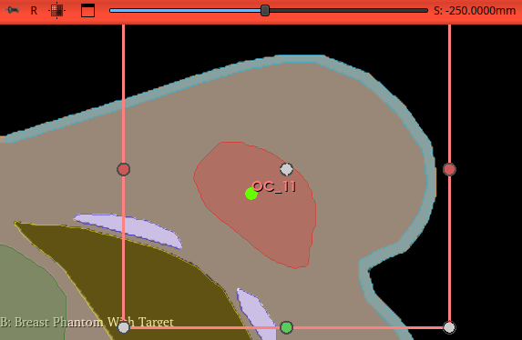

# Catheters
If you loaded an RT plan during the plan initialization, the catheter table will automatically be populated.

If not, the **Catheter tab** in the RapidBrachy Module allows you to create or remove catheter objects. 

## Adding Catheters

1. Open the **Markups module** in the modules tab . 
2. In the Create Markups menu, select `Curve` to create a new `MarkupsCurve` object.

    

3. Move your cursor to the 2D display panel showing the plane perpendicular to the catheter axis.
4. Scroll through the slices to locate the starting position for your catheter.
5. Left-click to place the first point (illustrated by the green dot labelled OC_11 in the figure below).

    

6. Scroll to the next slice and left-click to place the next point. Repeat this process to trace the catheter's path.
7. Double left-click to place the final point and complete the curve.

Repeat steps 2 through 7 for each desired catheter. Once finished, navigate to the **Catheter tab** in the RapidBrachy module. Under `Add new catheter`, input the desired dwell position step size (in mm). Use the `Select Markups Curve` drop-down menu to select your newly created catheters one at a time, clicking `Add` for each. The catheter table will automatically populate based on the drawn curves and your chosen step size, assigning a default dwell time of 1 second to each position.

## Removing Catheters

To remove catheters from the table, navigate to the **Catheter tab** in the RapidBrachy module. Under `Catheter Operations`, select the desired catheters and click `Remove`.

**Note:** This action only clears the catheters from the table. If you want to permanently delete the catheter object from the scene, navigate to the Data module, find the object in the node list, right-click it, and select `Delete`.

## Shielded Applicator
ADD SHIELDED GUIDE