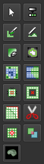
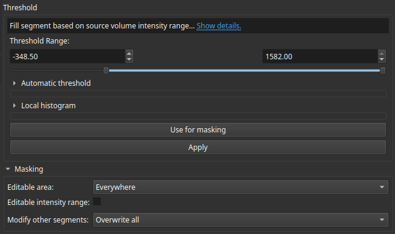
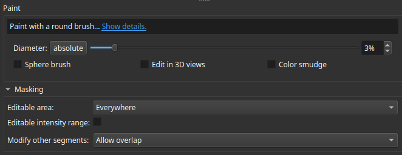

# Contouring

## Manual Contouring

Manual contouring can be performed from the **Segment Editor** module . The following steps describe the standard workflow for adding manual contours:

1. In the `Segmentation` drop-down menu, select the structure set you wish to add your contour to.
2. In the `Source volume` menu, select the corresponding volume.
3. Click the green `Add` button to add a new segment. Double-click this segment and rename it to the appropriate structure.
4. Ensure the newly added segment is highlighted in the list, then select your desired contouring tool (illustrated below).

    

    Depending on the structure you are contouring, choose one of the following tools:

#### Threshold Tool 
This tool is best suited for contouring structures with clear, distinct borders.

In the threshold menu, define the `Threshold Range`. The segment will automatically highlight any part of the volume that falls within this CT number range. Adjust the range until it accurately encloses the boundaries, then click `Apply`.

**Important**: Before applying, check the `Masking` section and ensure that `Modify other segments` is set to **Allow overlap**.

#### Paint Tool  
This tool is ideal for making small adjustments or manually drawing structures by hand. You can change the brush size by adjusting the `Diameter`. To modify multiple slices simultaneously, select the `Sphere brush` option, or use the `Edit in 3D views` option to paint directly in the 3D viewing panel. Once finished, click Apply.

**Important**: Before applying, check the `Masking` section and ensure that `Modify other segments` is set to **Allow overlap**.

#### Erase Tool 
This tool behaves identically to the Paint tool, but removes areas from the segment instead of adding them.

## Automatic Contouring
3D Slicer has several options for AI auto-contouring, such as [MONAIAuto3DSeg](https://github.com/lassoan/SlicerMONAIAuto3DSeg), available in the official 3D Slicer app.