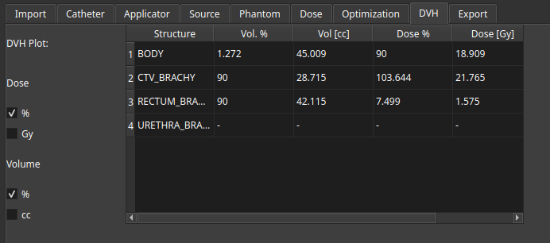
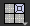
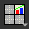
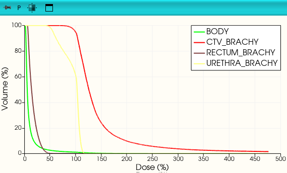

# DVH Metrics

You can view and analyze your DVH metrics in the **DVH tab** of the RapidBrachy module. To calculate metrics for a specific contoured structure, double-click a field to enter your target value, and the system will automatically populate the remaining metrics for that structure.

The DVH plot should automatically appear in the top-right display panel. If it is not visible, you can restore it by clicking the layout menu  and selecting the Four-Up Plot option . 

To change the axis units on the plot, use the toggles to switch between **Dose % and Gy**, and between **Volume % and cc**.
