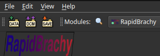
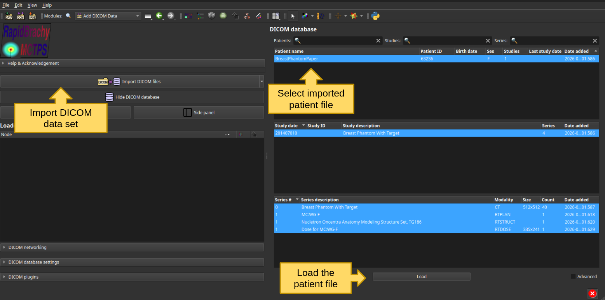
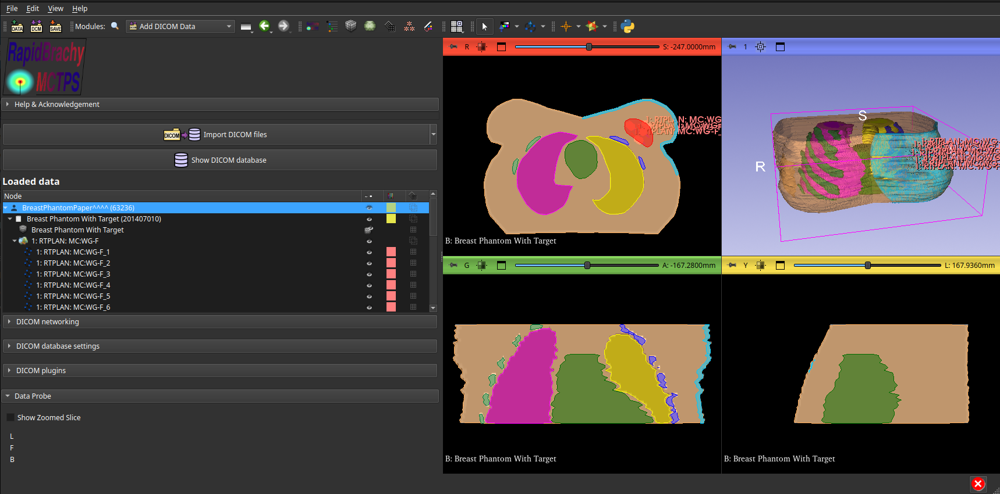

# Loading and Viewing Data
## Loading DICOM Data
You can import DICOM files by clicking `File` then `Add DICOM Data` or by clicking the DICOM Module widget just below the `Edit` tab.

This opens the DICOM Module, where you can import DICOM files and access your DICOM database. Click `Import DICOM files`, select your files, and import them into the database. The database maintains a cached list of patients that can then be loaded into the visualizer.

## Viewing DICOM Data
The TPS displays three orthogonal views by default. To change the layout, click the grey square icon in the module tab  and select the desired view; the default layout is Four-Up.

You can scroll through image slices using the mouse wheel. To pan the image, click and hold the mouse wheel and drag (or hold Shift + left click and drag). To zoom, right-click and drag.

