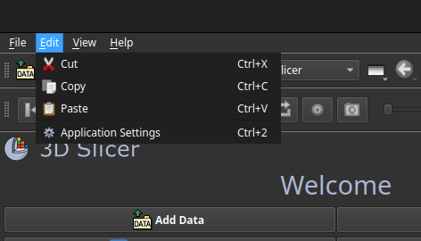
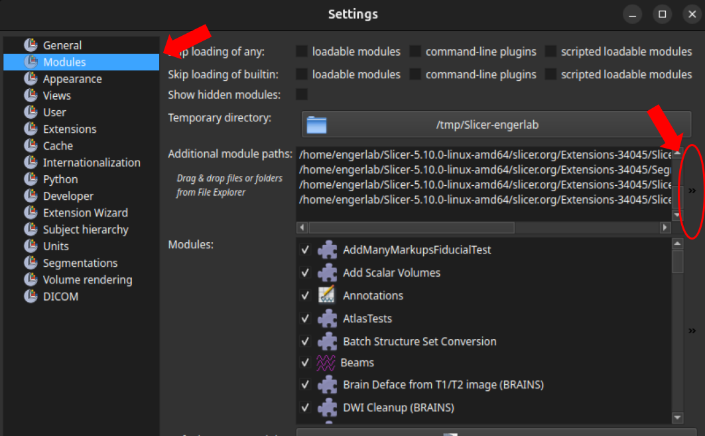
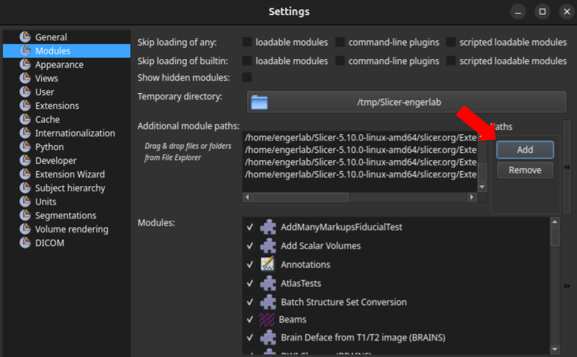
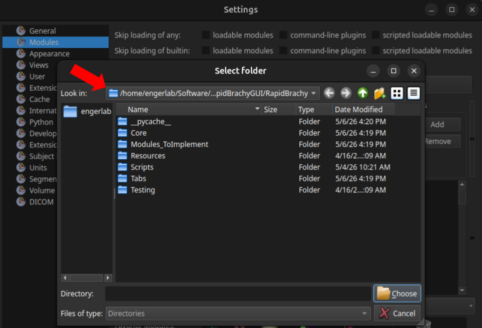

# Getting Started

## Installation Guide
There are two options when installing RapidBrachyMCTPS:

1. **Installing the RapidBrachyMCTPS standalone application.**
2. **Running the RapidBrachy software as a custom module in 3D Slicer.**

We recommend the **Standalone Application** for clinical users who want a streamlined, turnkey experience, and the **Custom Slicer Module** for researchers who want to integrate our tools with other 3D Slicer extensions. **Please note that the Standalone Application is currently only available for Linux systems**. 

| Feature | Standalone App | Custom Module (3D Slicer) |
|---|---|---|
| **Best For** | Clinicians, standard users | Researchers, developers |
| **Setup** | Download and run | Requires 3D Slicer installation |
| **Interoperability** | Isolated environment | Works alongside other Slicer extensions |

---
### Standalone Application
This version includes everything you need to run RapidBrachyMCTPS right out of the box.

1. Download the latest release from the [OneDrive](#).
2. Extract the downloaded archive to your preferred directory.
3. Run the `RapidBrachyMCTPS` executable file.


### 3D Slicer Custom Module
If you prefer to use 3D Slicer's full capabilities while still utilizing the features from RapidBrachyMCTPS or you already use 3D Slicer and want to add RapidBrachyMCTPS to your existing toolkit, you can do so by installing RapidBrachy as a custom module.

To get started, install [3D Slicer](https://www.slicer.org/). Then clone the repositories [RapidBrachyGUI](https://github.com/engerlab/RapidBrachyGUI.git) and [brachyutils](https://github.com/engerlab/brachyutils). We recommend the location `${HOME}/Software/` for cloning these repositories.

#### Install brachyutils
You'll need to install brachyutils inside 3D Slicer's python environment. Launch the 3D Slicer interface and inside the Python Console, run:
```python
from slicer.util import pip_install
pip_install("-e /Path/To/brachyutils")
```
Note: if you are using **Windows**, the Path/To/brachyutils should take forward slashes '/' and not backslashes '\\'.

Restart 3D Slicer, then run 
```python
import brachyutils
``` 
in the Python console to make sure the module is installed. You may get pydantic warnings, ignore them.

#### Install SlicerRT
Next, you'll need to install SlicerRT. Open 3D Slicer, click on `Extension Manager`  and type SlicerRT in the search bar. Install SlicerRT and restart 3D Slicer.

#### Install RapidBrachyGUI
Next, you'll need to install RapidBrachyGUI. Open 3D Slicer, click on `Edit`, then open `Application Settings`. On the left panel, click `Modules`, go to the `Additional module paths:` and add the path to RapidBrachyGUI. Then restart 3D Slicer.










To access the RapidBrachy module, either search for it using the module search bar or select `Brachytherapy` from the module dropdown menu and choose RapidBrachy.

For easier access, it is recommended to add RapidBrachy to your favorites toolbar. To do this, once again open `Edit`>`Application Settings`>`Modules`. This time, in the Modules list, scroll down to find RapidBrachy, then drag and drop it into the Favorite Modules list and click OK.

RapidBrachy will now appear in the toolbar at the top of the screen, allowing you to access it quickly at any time.

### Installing RapidBrachyMC
If you will want to run Monte Carlo simulations, you will need to install [RapidBrachyMC](https://github.com/engerlab/RapidBrachyMC), the Geant4-based Monte Carlo engine. You have two options when installing RapidBrachyMC:

1. Installing RapidBrachyMC from source.
2. Installing the RapidBrachyMC Docker image (**recommended**).

Installation instructions for both options are outlined in the [RapidBrachyMC GitHub Repository](https://github.com/engerlab/RapidBrachyMC). If you choose to use the Docker Image, you will need to have [Docker Engine](https://docs.docker.com/engine/install/) (Linux) or [Docker Desktop](https://docs.docker.com/desktop/setup/install/windows-install/) (Windows) installed.

#### For Developers
If you are developing this module, enable Developer Mode in Slicer by navigating to `Edit` > `Application` > `Settings` > `Developer` and clicking `Enable developer mode`.

## Dark Mode
Dark mode is recommended, but it is up to personal preference. You can select the appearance mode by clicking **Edit** on the top left and navigating to **Application Settings > Appearance**, under **Style**, select your preferred style.