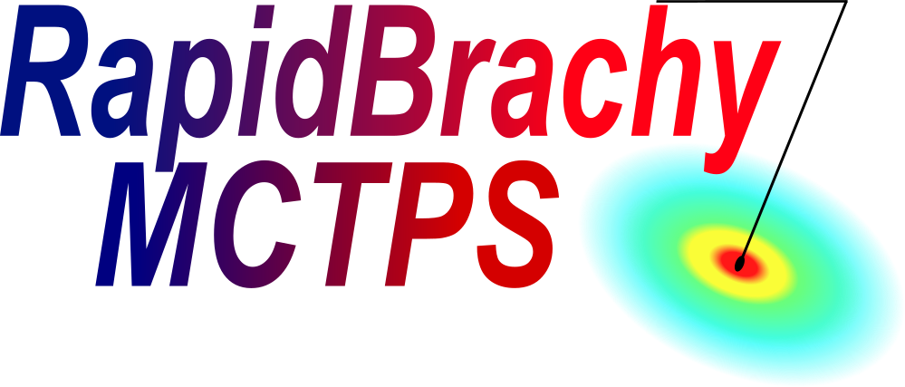

# Nuclear Medicine

The RapidBrachyMCTPS standalone app also comes equipped a nuclear medicine module called RapidTheraDose. If you are using the RapidBrachy module as a custom module in 3D Slicer and would like to use RapidTheraDose, follow the instructions in the [RapidTheraDose installation guide](installation.md#installing-rapidtheradose).

To access the module, click the **RapidTheraDose Module** { width="30" }. In the standalone application, it is available in the top module tab by default. Otherwise, you can find it in the module dropdown under `Nuclear Medicine` > `RapidTheraDose`, or use the `Find Module` button and search for "RapidTheraDose" if you are using RapidBrachyMCTPS as a 3D Slicer custom module.

## Import Tab
Once in the **RapidTheraDose Module**, open the **Import tab**. Here, you can load the required images, structures, and dose files for your plan. **Note**: Your DICOM files must already have be loaded into the Slicer scene before initializing a plan; see the [loading DICOM data section](import.md#loading-and-viewing-data).

Once the DICOM files are loaded into the scene, select an `Image Volume` (CT, MRI, or US Image), `Structure set` (contours), and optionally a `SPECT/PET Volume` or `Dose volume`. Then click `Initialize Plan`, this will enable all other tabs.

## Phantom Tab
The Phantom tab allows you to generate a phantom object, assign materials and densities to contoured structures, and define the phantom resolution. Creating a phantom is required before performing dose calculations or generating EGSphant and `.mac` files.

The typical workflow for creating a phantom is:

1. **Upload a materials table**. The materials table is a plain-text (.txt) file with the same format described in the [Assigning Material and Density section](phantom.md#assigning-material-and-density). The `Hounsfield_Unit` column is not used during in this module, but each row must contain a placeholder numeric value (integer or floating-point) in that column. These values must increase monotonically from top to bottom.
2. **Assign materials to contour structures**. In the Material column, select the desired material for each structure. The corresponding density is automatically populated from the materials table but can be adjusted manually if needed.
3. **Set the phantom resolution**. Specify the voxel resolution in the X, Y, and Z directions.
4. **Click Initialize Phantom**.

## Dose Tab
There are three available dose calculation options:

1. **LDM** (Local Deposition Method).
2. **VSV** (Voxel S-Value).
3. **MC** (Monte Carlo).

Select an output directory, then select the desired option listed under the **Algorithm** drop-down menu.

### LDM
* Input the appropriate source metrics and click `Calculate LDM Dose`.
* The algorithm outputs `.3ddose` files; one for each contoured structure and one for the whole image.

LDM is a rapid, voxel-level dosimetry technique that assumes all emitted radioactive energy is completely absorbed within the exact voxel where the decay occurs. By assuming zero energy escapes to neighboring tissues, LDM computes extremely quickly. This makes it ideal for alpha emitters and low-energy beta particles whose physical range is smaller than a single imaging voxel, though it will underestimate adjacent tissue doses for highly energetic beta particles or penetrating gamma rays.

### VSV
* Input the appropriate source metrics and click `Calculate VSV Dose`.
* The algorithm outputs `.3ddose` files; one for each contoured structure and one for the whole image.

VSV is a dosimetry technique that calculates the dose to a specific voxel by summing the radiation contributions from radioactive decay in that voxel and all surrounding voxels. It uses pre-calculated dose kernels, known as S-values, to accurately model the "cross-fire" effect of penetrating radiation escaping one tissue and depositing energy in another. By convolving the patient's 3D activity distribution with these kernels, VSV provides a highly accurate dose estimate for beta and gamma emitters without the massive computation time of full Monte Carlo simulations, though it typically assumes a uniform tissue density (like water) throughout the patient.

### MC
* Input the path to the reDoseV3 executable: 
    * The executable is stored in the same Docker image as RapidBrachyMC; see [the instructions on how to install it](installation.md#using-docker-image-recommended). 
    * The path should be set by default to **http://172.30.10.11:8000/calculate_dose_redose**.
    * If you are using **Windows** and you are running **Docker Desktop**, you will need to manually change the path to **http://127.0.0.1:8000/calculate_dose_redose**
* The `Filename` will be used for the `.plan`, `.mac`, and `.egsphant` files.
* Select one of the `Plan Modality` options:
    * `SPECT/PET`: the MC simulation will operate using the PET/SPECT file as a template. You must enter a threshold value.
    * `CT`: the MC simulation will operate using a single contoured structure as the injection point. You must enter a CT plan organ from the list.
* The algorithm outputs a `.3ddose` file.

## Export Tab
The export tab allows you to output the following files:

* **EGSphant**: A `.egsphant` file for the phantom generated in the **Phantom tab**.
    * You must enter a name for the `.egsphant` file. The default is `phantom`.
* **CT Plan**: A `.plan` file with uniform activity from a CT contour.
    * You must select an organ/contour to use.
* **NM Plan**: A `.plan` file from a nuclear medicine image (PET or SPECT).
    * You must enter a threshold value: the percentile threshold for selecting hottest voxels.
* **MAC File**: A `.mac` file required to run a Monte Carlo simulation. **Note**: An EGSphant file is also required for Monte Carlo simulations.
    * You must enter the number of computer threads to use during the simulation, the number of histories (number of events/particles to simulate), the atomic mass, and the atomic number.
* **Metrics JSON File**: A `.json` file containing a summary of the files exported.

