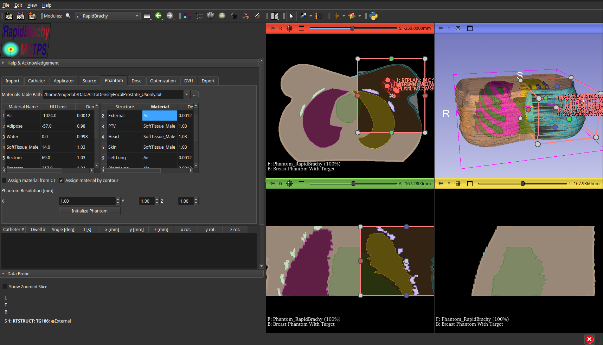

# Assigning Material and Density

Materials and densities are assigned in the **Phantom tab** of the RapidBrachy module. You must first import a materials table by entering the file path into the `Materials Table Path` field. 

The materials table is a standard text file where each line defines a material using the following format (separated by spaces):
```Plaintext
Material_Name_1 Density(g/cm3) Hounsfield_Unit
Material_Name_2 Density(g/cm3) Hounsfield_Unit
Material_Name_3 Density(g/cm3) Hounsfield_Unit
...
```
The values in the table represent the minimum possible HU and density for that material. The system calculates the final density by linearly interpolating between a material's defined point and the point defined for the next material in the sequence.

You have two options for assigning material and density, selectable via their corresponding checkboxes:

1. Assign material from CT
2. Assign material by contour

It is **strongly recommended** to assign materials by contour. Relying solely on CT numbers for material and density can lead to inaccurate simulation results.

### Assigning Material from CT
If you choose to assign materials from a CT scan, each voxel is automatically assigned a corresponding material and density from the materials table based on its CT number.

### Assigning Material by Contour (Recommended)
If you choose to assign materials by contour, you must manually assign the material and density for each individual structure. You can do this by locating the structure in the provided table and double-clicking the `Material` and `Density` cells to edit their values directly. **Note:** The TPS will provide an initial guess for each structure's material and density once the materials table is loaded.

### Initialize Phantom
Once you have assigned the materials and densities, set a resolution for your phantom and click `Initialize Phantom`. This will create a phantom based on the size of the chosen ROI.


