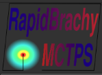
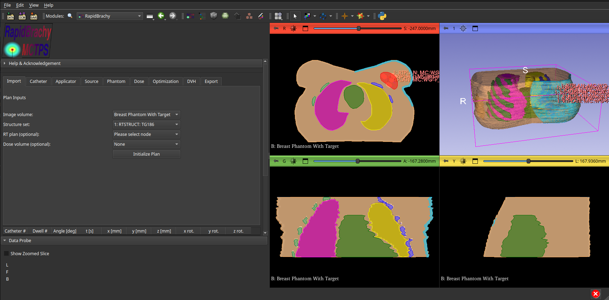
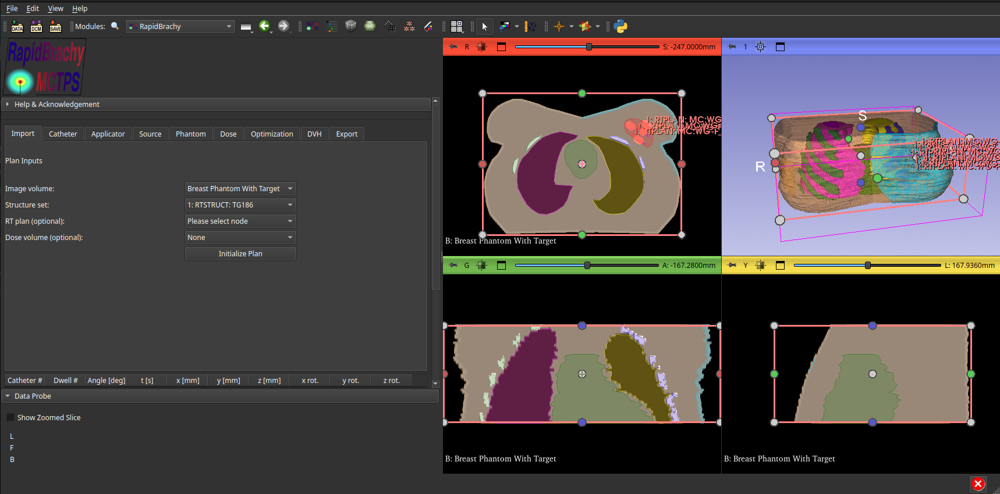
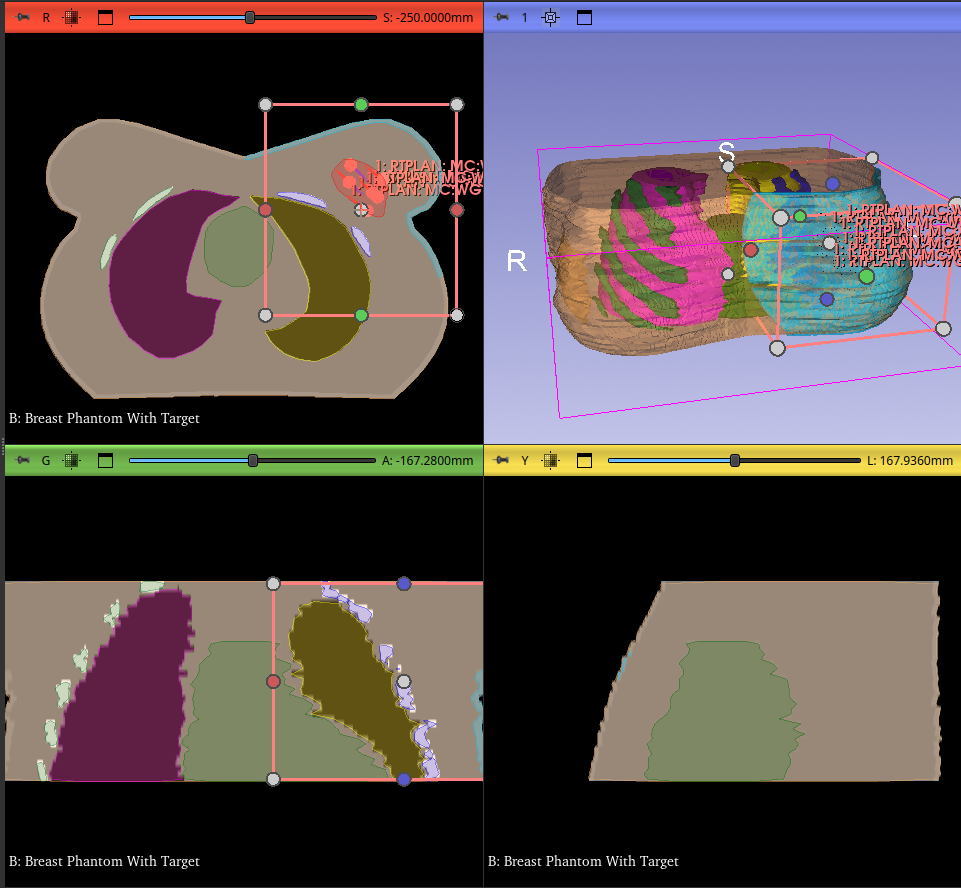
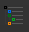

# Initializing a Plan
To initialize a plan, open the **RapidBrachy Module** . In the standalone application, it is available in the top module tab by default. Otherwise, you can find it in the module dropdown under `Brachytherapy` > `RapidBrachy`, or use the `Find Module` button and search for "RapidBrachy" if you are using RapidBrachyMCTPS as a 3D Slicer custom module.

Once in the **RapidBrachy Module**, open the **Import tab**. Select an `Image Volume` (CT, MRI, or US Image) and `Structure set`, and optionally an `RT plan` or `Dose volume`. Then click `Initialize Plan`.

The loaded data will now appear in the viewing panels, overlaid with a pink box representing the Region of Interest (ROI). Adjust this box along all three orthogonal axes to include only the anatomy you want evaluated during dose calculations. Keep in mind that the smaller the ROI, the faster the MC and TG-43 simulations will run.

To inspect the individual nodes, navigate to the **Data** in the module tab . For a detailed overview of the terminology and structure used in 3D Slicer and RapidBrachyMCTPS, refer to the [Slicer MRML Documentation](https://slicer.readthedocs.io/en/latest/developer_guide/mrml_overview.html).