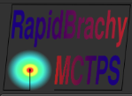

# Initializing a Plan
To initialize a plan, open the **RapidBrachy Module** { width="25" }. In the standalone application, it is available in the top module tab by default. Otherwise, you can find it in the module dropdown under `Brachytherapy` > `RapidBrachy`, or use the `Find Module` button and search for "RapidBrachy" if you are using RapidBrachyMCTPS as a 3D Slicer custom module.

{ width="900" }

Once in the **RapidBrachy Module**, open the **Import tab**. Select an `Image Volume` (CT, MRI, or US Image) and `Structure set`, and optionally an `RT plan` or `Dose volume`. Then click `Initialize Plan`.

The loaded data will now appear in the viewing panels, overlaid with a pink box representing the Region of Interest (ROI). Adjust this box along all three orthogonal axes to include only the anatomy you want evaluated during dose calculations. Keep in mind that the smaller the ROI, the faster the MC and TG-43 simulations will run.

{ width="900" }

{ width="600" }

You can also automatically generate a ROI based on existing structures rather than defining it manually.

1. Navigate to the **ROI tab** and use the `Conform to contours` drop-down menu to select the structures you want to include.
2. Specify a margin (in mm) to define the buffer distance between your selected structures and the outer ROI boundary.
3. Click `Update` and wait for the software to generate the new bounding volume.

Instead of setting the ROI manually, you can systematically set the ROI by structure from the **ROI tab**. Select the desired structures to be included in the ROI from the `Conform to contours` drop-down menu. Then input a margin (in mm) indicating the buffer space between the structure and the border of the ROI. Click `Update` and wait for the ROI to update.

To inspect the individual nodes, navigate to the **Data** in the module tab { width="25" }. For a detailed overview of the terminology and structure used in 3D Slicer and RapidBrachyMCTPS, refer to the [Slicer MRML Documentation](https://slicer.readthedocs.io/en/latest/developer_guide/mrml_overview.html).