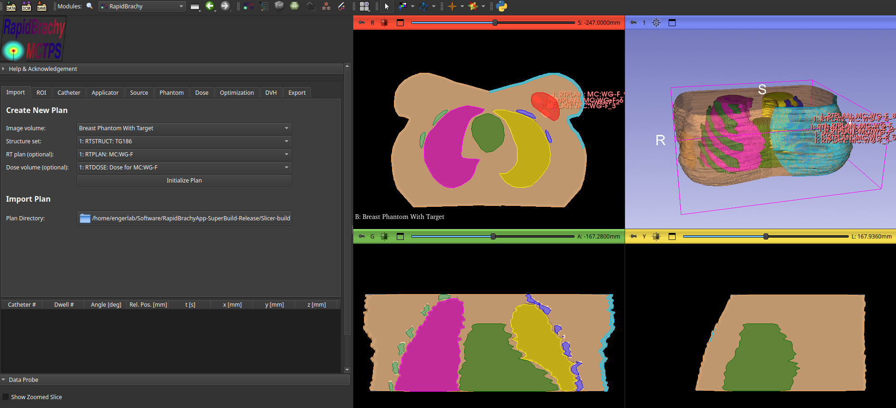
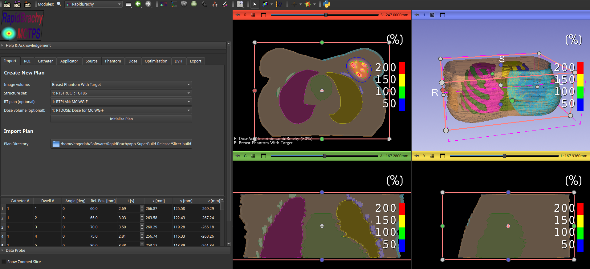
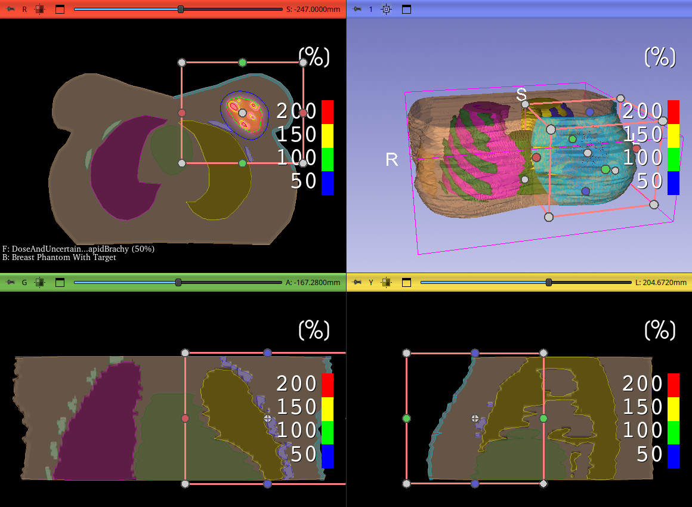
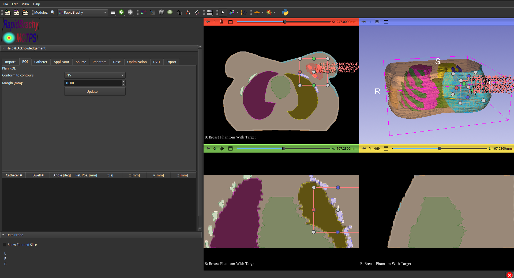

# Initializing a Plan
To initialize a plan, open the **RapidBrachy Module** { width="30" }. In the standalone application, it is available in the top module tab by default. Otherwise, you can find it in the module dropdown under `Brachytherapy` > `RapidBrachy`, or use the `Find Module` button and search for "RapidBrachy" if you are using RapidBrachyMCTPS as a 3D Slicer custom module.

{ width="900" }

Once in the **RapidBrachy Module**, open the **Import tab**. Here, you have two options:

1. Create a new plan.
2. Import an existing plan.

### Create a new plan
To create a new plan, you must already have loaded DICOM data from the **DICOM Module**, see [instructions under Data Loading and Viewing](import.md#loading-dicom-data). Select an `Image Volume` (CT, MRI, or US Image) and `Structure set`, and optionally an `RT plan` or `Dose volume`. Then click `Initialize Plan`.

### Import an existing plan
To import an existing plan, it must be a plan that has already been exported by RapidBrachyMCTPS from the **Export tab**, using the RapidBrachyGUI preset.

### Setting a ROI
Once a plan is created/loaded, the data will appear in the viewing panels, overlaid with a pink box representing the Region of Interest (ROI). Adjust this box along all three orthogonal axes to include only the anatomy you want evaluated during dose calculations. Keep in mind that the smaller the ROI, the faster the MC and TG-43 simulations will run.

{ width="900" }

{ width="600" }

### ROI by Contour
You can also automatically generate a ROI based on existing structures rather than defining it manually.

1. Navigate to the **ROI tab** and use the `Conform to contours` drop-down menu to select the structures you want to include.
2. Specify a margin (in mm) to define the buffer distance between your selected structures and the outer ROI boundary.
3. Click `Update` and wait for the software to generate the new bounding volume.

{ width="900" }
