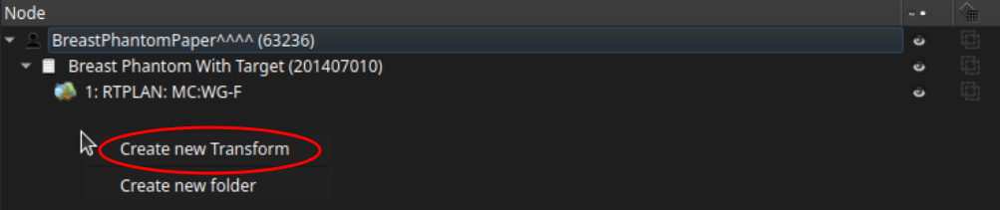
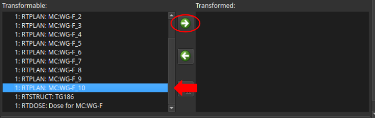
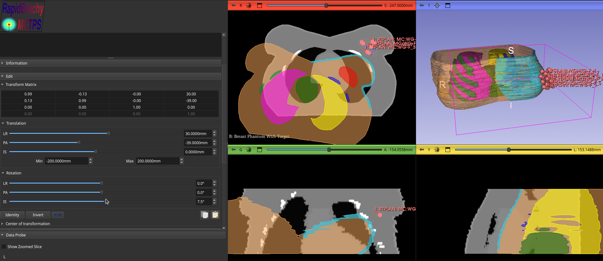
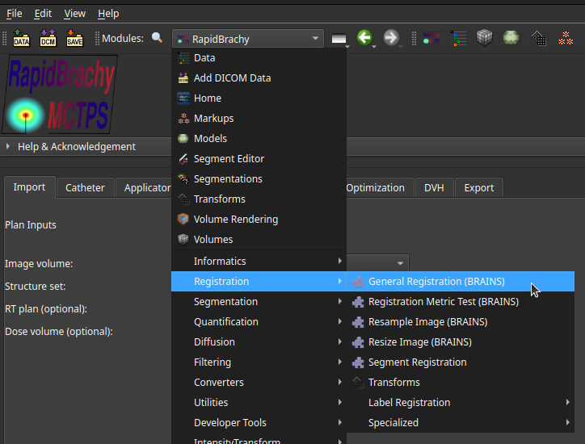
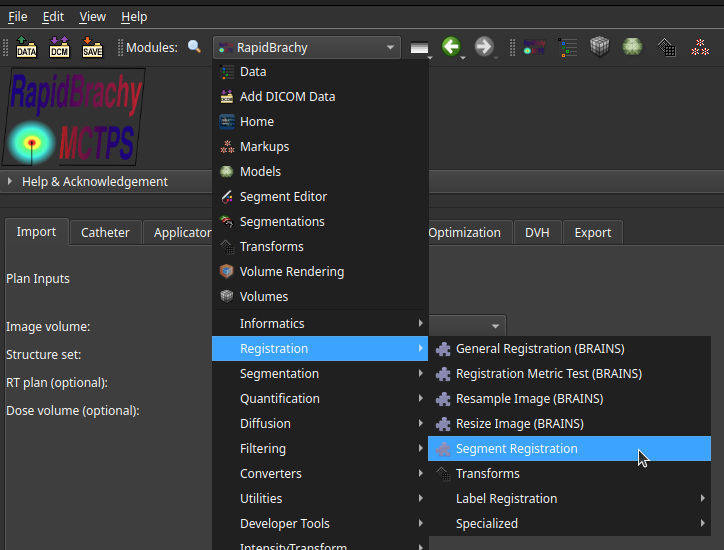

# Registration

## Manual Registration

Manual registration can be performed from the **Transforms module** . The following steps describe the standard workflow:

1. In the `Node` table, right-click the space beneath the existing nodes and select `Create new Transform`.

    

2. With the new transform selected, scroll down to the `Transformable` list. Select the node you want to register, then click the right-facing green arrow to move it to the `Transformed` list.

    

3. Use the `Translation` and `Rotation` sections to manually adjust the position and angle of the selected node until it is properly aligned.

    

## Automatic Registration
### General Registration
Automatic registration of entire image volumes can be performed using the **General Registration (BRAINS)** module. Access this from the **Modules drop-down menu > Registration > General Registration (BRAINS)**.

For detailed instructions on operating this tool, refer to the official [General Registration (BRAINS) documentation](https://slicer.readthedocs.io/en/latest/user_guide/modules/brainsfit.html).

### Contour/Segment Registration
If you need to align datasets based on specific contoured structures (for example, registering an MRI segmentation to an Ultrasound segmentation), use the SlicerRT **SegmentResistration** module. Access this from the **Modules drop-down menu > Registration > SegmentRegistration**.

1. In the `Registration` menu, select your desired inputs for the `Image`, `Segmentation`, and `Segment` fields under both the `Fixed` and `Moving` sections.

2. Click `Perform Registration`.

3. Once the registration is complete, you can evaluate the alignment by toggling the `Applied registration on moving study` option between `None`, `Rigid`, and `Deformable`.
